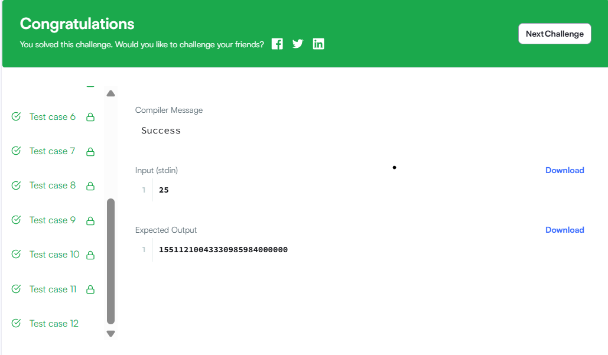

# Бодлого 21
Хэрэв холбогдсон жагсаалтыг дайран өнгөрөхөд ямар нэгэн зангилааг нэгээс олон удаа үзсэн бол тэр жагсаалтад мөчлөг агуулагдана гэж хэлнэ. Холбогдсон жагсаалтын толгой зангилаа руу заагчийг өгөхөд тэр жагсаалтад мөчлөг агуулагдаж байгаа эсэхийг тодорхойлно уу. Хэрэв агуулж байвал 1-ийг буцаана. Үгүй бол 0-ийг буцаана.

Жишээ

1 -> 2 -> 3 -> NULL нь зангилаануудын жагсаалтыг илэрхийлнэ. Үзүүлсэн тоонууд нь өгөгдлийн утга биш, харин зангилааны дугаарууд юм. Энэ жагсаалтад мөчлөг байхгүй тул 0-ийг буцаана.

1 -> 2 -> 3 -> 1 (cycle) нь зангилаануудын жагсаалтыг илэрхийлнэ. Энэ жагсаалтад зангилаа 3 нь зангилаа 1 рүү буцаж зааж байгаа мөчлөг байгаа тул 1-ийг буцаана.

Функцийн тайлбар

Доорх засварлагчид байгаа has_cycle функцийг гүйцээгээрэй.
Энэ нь дараах параметртэй:

SinglyLinkedListNode pointer head: Жагсаалтын толгой руу заагч
Буцаах утга

int: Хэрэв мөчлөг байгаа бол 1, эсвэл байхгүй бол 0-ийг буцаана.
Тэмдэглэл: Хэрэв жагсаалт хоосон бол head нь null байна.

Оролтын формат

Кодын хэсэг нь стандартын оролтоос уншиж, функцэд зохих аргументийг дамжуулна. Энэ асуултын хувьд өөрчлөн тохируулсан туршилтын кейсийн форматыг нарийн төвөгтэй байдлаас нь болоод тайлбарлахгүй. Хэрэв та өөрчлөн тохируулсан кейсийг хэрхэн үүсгэхээ мэдэхийг хүсвэл үндсэн функцийн хэсгийг өргөжүүлж, кодыг хянана уу.

Хязгаарлалт

0≤ жагсаалтын урт ≤1000
Жишээ оролт

Таны функцэд дараах холбогдсон жагсаалтуудын тус бүрийн лавлагааг аргумент болгон дамжуулна:

1 -> 2 -> 3 -> NULL
1 -> 2 -> 3 -> 1 (cycle)
Жишээ гаралт

0
1

Тайлбар

Эхний жагсаалтад мөчлөг байхгүй тул 0-ийг буцаана.
Хоёр дахь жагсаалтад мөчлөг байгаа тул 1-ийг буцаана.

  

