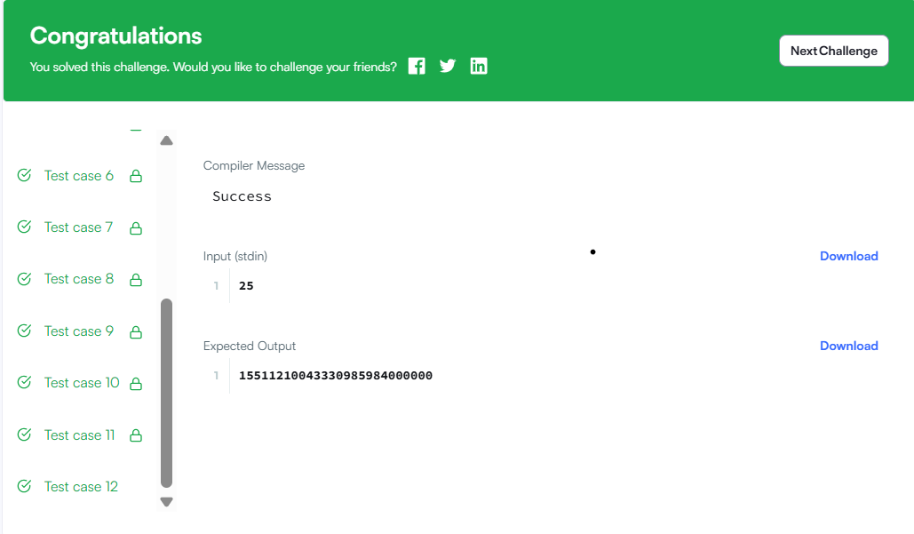

#  Бодлого 26

> HackerRank - Data Structures 
> Difficulty: Medium  

Дараалал нь элементүүдийг нэмсэн дарааллыг хадгалдаг хийсвэр өгөгдлийн төрөл бөгөөд хамгийн хуучин элементүүдийг урдаас нь авч, шинэ элементүүдийг ар талд нь нэмэх боломжийг олгодог. Энэ нь Эхэнд Орсон нь Эхэнд Гарна (FIFO) өгөгдлийн бүтэц гэж нэрлэгддэг, учир нь дараалалд нэмэгдсэн анхны элемент (өөрөөр хэлбэл хамгийн удаан хүлээсэн элемент) үргэлж хамгийн түрүүнд авагддаг.

Үндсэн дараалал нь дараах үйлдлүүдийг агуулдаг:

Enqueue: шинэ элементийг дарааллын төгсгөлд нэмнэ.
Dequeue: дарааллын урдаас элементийг авч, буцаана.
Энэ сорилтод та эхлээд хоёр стек ашиглан дараалал хэрэгжүүлэх ёстой. Дараа нь q хүсэлтийг боловсруулна, энд хүсэлт бүр нь дараах 3 төрлийн нэг юм:

1 x: x элементийг дарааллын төгсгөлд нэмнэ.
2: Дарааллын урд талын элементийг авна.
3: Дарааллын урд талын элементийг хэвлэнэ.
Оролтын формат

Эхний мөрөнд q гэсэн ганц бүхэл тоо байна, энэ нь хүсэлтийн тоог илэрхийлнэ.
Дараагийн q мөр тус бүр нь дээрх асуудлын тайлбарт заасан хэлбэрээр ганц хүсэлтийг агуулна. Бүх гурван хүсэлт нь хүсэлтийн төрлийг илэрхийлэх бүхэл тоогоор эхэлдэг, гэхдээ зөвхөн төрөл 1 хүсэлт нь нэмэх элементийн утгыг илэрхийлэх нэмэлт зайгаар тусгаарлагдсан x утгатай байдаг.

Хязгаарлалт

1≤q≤10**5
 
1≤x≤10**9
 
Төрөл 2 эсвэл 3 хүсэлт бүрийн хувьд хүчинтэй хариулт үргэлж байдаг нь баталгаатай.

Гаралтын формат

Төрөл 3 хүсэлт бүрийн хувьд дарааллын урд талын элементийн утгыг шинэ мөрөнд хэвлэнэ.

Жишээ оролт

STDIN   Функц
-----   --------
10      q = 10 (хүсэлтийн тоо)
1 42    1-р хүсэлт, 42-ыг нэмнэ
2       урд талын элементийг авна
1 14    14-ыг нэмнэ
3       урд талын элементийг хэвлэнэ
1 28    28-ыг нэмнэ
3       урд талын элементийг хэвлэнэ
1 60    60-ыг нэмнэ
1 78    78-ыг нэмнэ
2       урд талын элементийг авна
2       урд талын элементийг авна
Жишээ гаралт

14
14
Тайлбар

Дараах үйлдлүүдийг гүйцэтгэнэ:

42-ыг нэмнэ; дараалал: [42].
Дарааллын толгой дахь утга 42-ыг авна; дараалал: [].
14-ыг нэмнэ; дараалал: [14].
Дарааллын толгой дахь утга 14-ыг хэвлэнэ; гаралт: 14.
28-ыг нэмнэ; дараалал: [14, 28].
Дарааллын толгой дахь утга 14-ыг хэвлэнэ; гаралт: 14.
60-ыг нэмнэ; дараалал: [14, 28, 60].
78-ыг нэмнэ; дараалал: [14, 28, 60, 78].
Дарааллын толгой дахь утга 14-ыг авна; дараалал: [28, 60, 78].
Дарааллын толгой дахь утга 28-ыг авна; дараалал: [60, 78].

  

